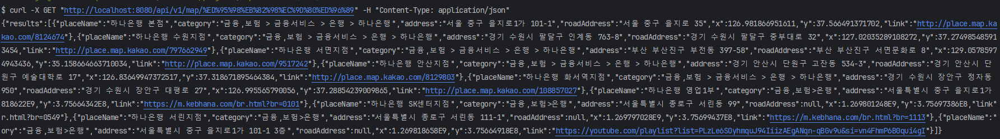
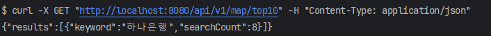

# Map Searcher
## Goal
외부 검색 API를 통합하여 사용자가 입력한 키워드를 통해 장소 정보를 제공하는 서비스를 개발합니다.

## Dev Environment
- Kotlin
- Spring Boot
- R2DBC
- Coroutine
- Redis (Embeded)
- H2
- Junit

## Build, Run
```shell
./gradlew bootRun
```

## API Documentation
API docs 는 Swagger 를 통해서 확인 가능합니다.

CURL 도 호출은 가능하지만, 한글 키워드의 경우 인코딩이 필요합니다.

스웨거를 통해 호출하시면, 따로 인코딩 변환없이 호출 가능합니다. 

```shell
# 하나은행 조회 CURL
curl -X GET "http://localhost:8080/api/v1/map/%ED%95%98%EB%82%98%EC%9D%80%ED%96%89" -H "Content-Type: application/json"
```



```shell
# 키워드 검색 순위 TOP 10 조회 CURL
curl -X GET "http://localhost:8080/api/v1/map/top10" -H "Content-Type: application/json"
```


http://localhost:8080/swagger-ui/index.html


## 요구사항 파악
* 서비스 요구사항
  * 사용자가 키워드를 입력하면 각 지도 API의 결과를 통합하여 반환
    * 각 API 별 중복되는 정보의 우선 순위가 제일 높음
      * Map을 통해 위치명을 Key로 지역 정보를 List의 형태로 적재
      * List의 size 가 2 이상이면, 중복되는 정보 (우선순위 1)
      * List의 size 가 1 이면, 유니크한 정보 (후순위 카카오 -> 네이버)
    * 각 API 별 최대 5건의 정보를 조회하는데, 만약 특정 API가 5건 이하라면 다른 곳에서 추가 조회하여 총 10건을 맞춰야 함
      * 각 API 별 10건씩 조회 후, 5건씩 추출 시도 -> 추출 총 건수가 10 미만이라면 10건이 될 때까지 다른 API에서 가져와 총 10건을 맞춤
  * 검색이 높은 TOP 10에 대한 키워드를 조회 가능

* 기술 요구사항
  * 키워드 검색 count 증가의 경우, 분산락을 통한 동시성 이슈 해소
    * lock 대기에 의한 병목을 고려해, count 증가 로직을 비동기로 구현
    * 동기, 비동기 간 성능 테스트 진행 (약 3배의 성능 차이 확인. 1000건 병렬 호출 2s -> 0.5s )
  * 카카오, 네이버 외에 추가적인 검색 API에 대한 유연한 확장을 고려해 Strategy Pattern 적용
    * Search Interface만 추가적으로 구현으로 바로 적용 가능 (변경점 최소화)
  * 대용량 트래픽 처리를 위한 작업
    * coroutine - r2dbc - webclient - reactive redis 등 nio 기반 비동기 처리 시스템 구축
    * 짧은 레이턴시를 위한 1차 캐싱 처리
    * 고가용성을 위한 DR 캐싱 작업
      * 장애 시, circuit breaker를 통한 장애 전파 차단 및 DR 캐시를 통한 서비스 가용성 향상
    * 별도의 CoroutineScope를 통한 현재 코루틴과의 구조화된 동시성을 깨고, 완전 병렬적인 비동기 구조로 구현 

* 프로그래밍 요구사항 
  * UI 제외
  * 단위 테스트 추가

## Project 구조

1. 요청이 들어오면 (비동기) keyword count + 1을 진행합니다.
2. Searcher Interface의 구현체들을 통해 검색을 진행합니다.
    * 각 Searcher 들은 우선 순위에 따라 Ordering(`@Order`) 되어 있습니다. (Kakao -> Naver 순)
3. 실제 API 호출하기 전 캐싱된 데이터가 있는지 확인합니다.
4. 캐싱된 데이터가 없다면 API 호출을 진행합니다.
5. API 호출 결과를 (비동기) 캐싱(일반 캐싱, DR 캐싱)하고 반환합니다.
    * 만약, API 호출 실패 및 Circuit Breaker가 발동하면 DR 캐싱된 데이터를 반환합니다.
6. 반환된 결과들에 대해서 우선순위에 따른 Sorting 및 Filtering 작업을 진행합니다.
7. 최종 결과를 반환합니다.

## Table Architecture

1. keyword_history
   * 검색된 키워드와 검색 횟수를 저장하는 테이블입니다.
   * 검색 횟수는 비동기로 증가시킵니다. (분산락을 통해 처리)

column | type   | description
--- |--------| ---
id | BIGINT | PK (auto increment)
keyword | VARCHAR(255) | 검색된 키워드
count | BIGINT | 검색 횟수

## Test Code List

## 성능테스트
### 키워드 검색 (1000 request call)
성능 테스트의 타겟은 Cache가 존재하는 상황으로 진행합니다.
* 비동기 처리
* 동기 처리

## 특이사항
1. 키워드 저장하는 데이터베이스는 손쉬운 어플리케이션 실행을 대비해 h2로 구현했습니다.
2. redis 또한 같은 이유로 embeded redis를 사용하여 구현했습니다.
3. api-key 들은 원칙적으로는 Secrets Management 에서 관리하는게 맞으나, 이 프로젝트는 임시로 제공되는 용도이므로 properties에 저장했습니다.
4. 현재는 동일한 Redis에 DR 구성했으나, 실제 운영 상황에서 가용성이 중요한 경우 Redis 를 분리하여 DR 캐싱을 구현할 수 있습니다.

## Package Structure
application 의 package 구조는 아래와 같습니다.

- client: 외부 통신을 위한 클라이언트 package
    - `kakao`, `naver`, `redis`
- config : 설정 package
- controller : 검색 및 검색 순위 조회 요청을 처리하는 package
- repository : 데이터베이스 접근을 위한 클래스
    - `keyword_history` table
- service : 비즈니스 로직을 처리를 담당하는 package
    - `searcher_strategy`  : Third Party 지도 API을 위한 구현체
    - `MapSearcherService` : 검색된 결과를 처리하는 서비스
    - `KeywordService` : 키워드 검색 횟수를 처리하는 서비스

