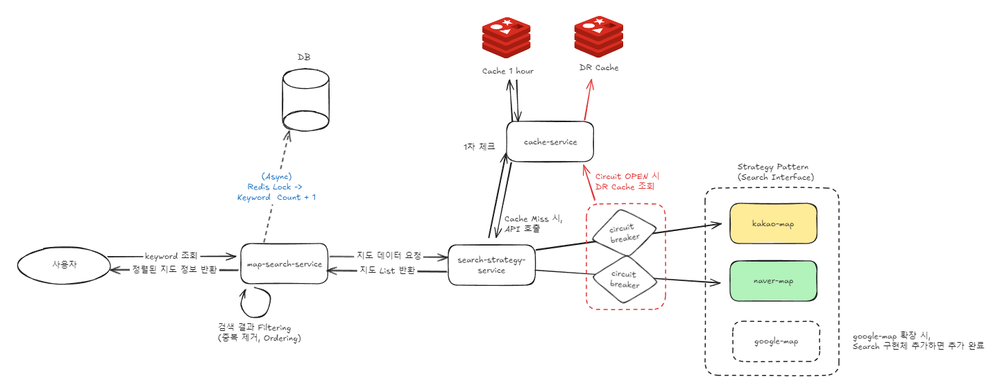

# Map Searcher
## Goal
외부 검색 API를 통합하여 사용자가 입력한 키워드를 통해 장소 정보를 제공하는 서비스를 개발합니다.

## Dev Environment
- Kotlin
- Spring Boot
- R2DBC
- Coroutine
- Redis (Embeded)
- H2
- Junit

## Build, Run
```shell
./gradlew bootRun
```

## API Documentation
API docs 는 Swagger 를 통해서 확인 가능합니다.

http://localhost:8080/swagger-ui/index.html


## 요구사항 파악
## Project 구조

1. 요청이 들어오면 (비동기) keyword count + 1을 진행합니다.
2. Searcher Interface의 구현체들을 통해 검색을 진행합니다.
    * 각 Searcher 들은 우선 순위에 따라 Ordering(`@Order`) 되어 있습니다. (Kakao -> Naver 순)
3. 실제 API 호출하기 전 캐싱된 데이터가 있는지 확인합니다.
4. 캐싱된 데이터가 없다면 API 호출을 진행합니다.
5. API 호출 결과를 (비동기) 캐싱(일반 캐싱, DR 캐싱)하고 반환합니다.
    * 만약, API 호출 실패 및 Circuit Breaker가 발동하면 DR 캐싱된 데이터를 반환합니다.
6. 반환된 결과들에 대해서 우선순위에 따른 Sorting 및 Filtering 작업을 진행합니다.
7. 최종 결과를 반환합니다.

## Table Architecture

1. keyword_history
   * 검색된 키워드와 검색 횟수를 저장하는 테이블입니다.
   * 검색 횟수는 비동기로 증가시킵니다. (분산락을 통해 처리)

column | type   | description
--- |--------| ---
id | BIGINT | PK (auto increment)
keyword | VARCHAR(255) | 검색된 키워드
count | BIGINT | 검색 횟수

## Test Code List

## 성능테스트
### 키워드 검색 (1000 request call)
성능 테스트의 타겟은 Cache가 존재하는 상황으로 진행합니다.
* 비동기 처리
* 동기 처리

## 특이사항
1. 키워드 저장하는 데이터베이스는 손쉬운 어플리케이션 실행을 대비해 h2로 구현했습니다.
2. redis 또한 같은 이유로 embeded redis를 사용하여 구현했습니다.
3. api-key 들은 원칙적으로는 Secrets Management 에서 관리하는게 맞으나, 이 프로젝트는 임시로 제공되는 용도이므로 properties에 저장했습니다.
4. 현재는 동일한 Redis에 DR 구성했으나, 실제 운영 상황에서 가용성이 중요한 경우 Redis 를 분리하여 DR 캐싱을 구현할 수 있습니다.

## Package Structure
application 의 package 구조는 아래와 같습니다.

- client: 외부 통신을 위한 클라이언트 package
    - `kakao`, `naver`, `redis`
- config : 설정 package
- controller : 검색 및 검색 순위 조회 요청을 처리하는 package
- repository : 데이터베이스 접근을 위한 클래스
    - `keyword_history` table
- service : 비즈니스 로직을 처리를 담당하는 package
    - `searcher_strategy`  : Third Party 지도 API을 위한 구현체
    - `MapSearcherService` : 검색된 결과를 처리하는 서비스
    - `KeywordService` : 키워드 검색 횟수를 처리하는 서비스

